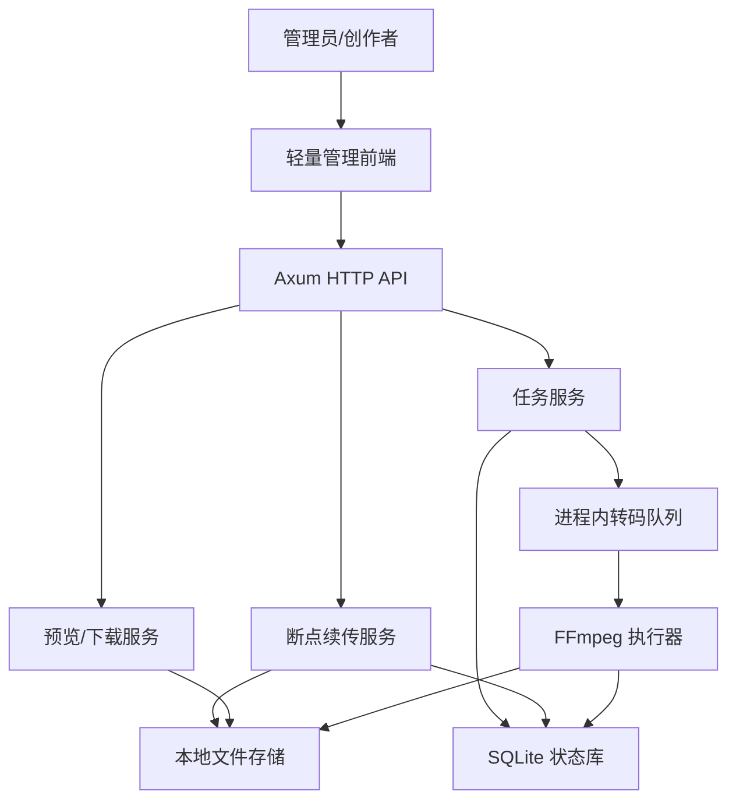
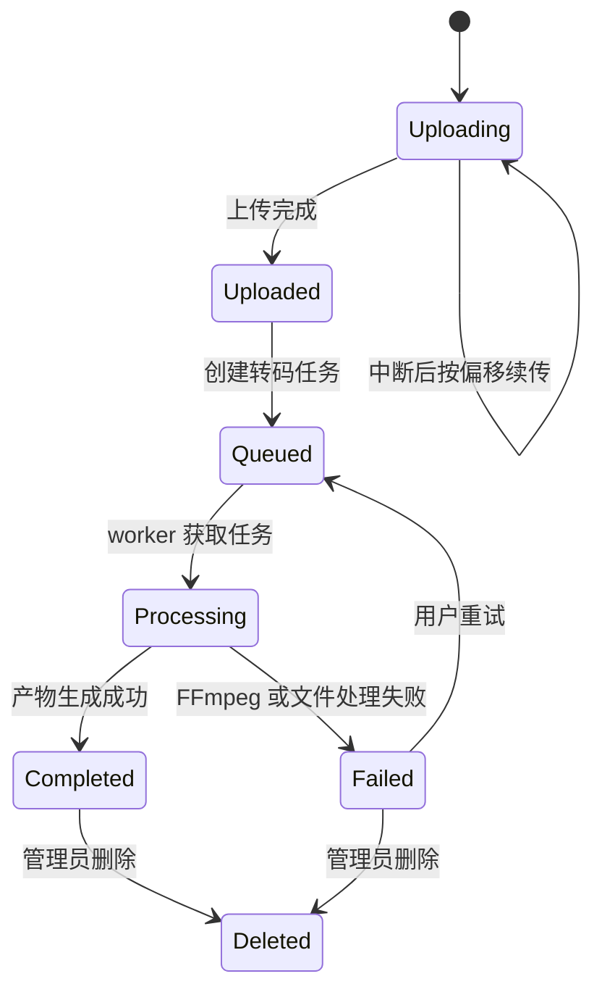
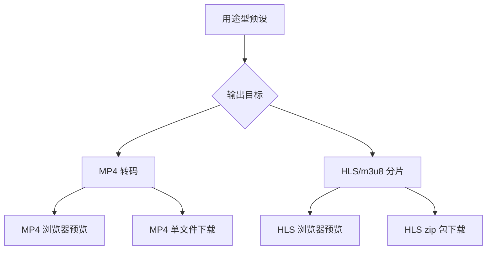

# feat: Build Rust Video Processing Web App

## Summary

构建一个单用户/管理员模式的 Rust Web 视频处理后台，覆盖完整第一版范围：2GB 级断点续传、服务端 FFmpeg 转码、MP4 默认输出、HLS/m3u8 高级输出、转码后预览、zip 下载、历史任务保留和手动清理。

---

## Problem Frame

目标用户的视频来源不统一，常见痛点是体积过大、格式不适合 Web 播放、课程站或 Web 应用需要 HLS 分片但原始视频没有可部署产物。需求文档已经确认第一成功指标是操作简单，因此实现计划应优先保证上传、预设、等待、预览和下载链路清晰，而不是暴露完整 FFmpeg 参数控制台。

当前仓库是绿地状态，仅存在上游需求文档。计划需要同时定义项目骨架、核心领域模型、HTTP/API 边界、后台转码流程、轻量管理前端和测试策略。

本地检查显示当前目录尚未初始化为 git 仓库。实现开始前应先确认是否初始化版本控制，以便后续提交、审查和自动化流程可用。

---

## Requirements

**Upload and task handling**

- R1. 应用必须支持单视频上传，第一版单文件上限为 2GB。
- R2. 上传必须支持断点续传，客户端能从服务端记录的偏移继续上传。
- R3. 应用必须在创建任务前执行硬编码保护：总存储上限 200GB，同时转码任务上限 2 个。
- R4. 任务必须呈现上传中、等待中、转码中、完成和失败等状态。

**Presets and outputs**

- R5. 应用必须提供博客、课程、移动端、高清留档等用途型预设。
- R6. 预设必须显示输出格式、分辨率、码率倾向和 HLS 分片摘要。
- R7. MP4 输出必须作为默认推荐路径。
- R8. 应用必须生成可下载、可预览的 MP4 产物。
- R9. 应用必须生成可预览的 HLS/m3u8 分片产物。
- R10. 用户必须能在 MP4 和 HLS/m3u8 输出目标之间选择。

**Preview, download, and retention**

- R11. 转码完成后必须提供浏览器内预览。
- R12. 预览必须覆盖 MP4 和 HLS/m3u8 两种产物。
- R13. MP4 必须以单文件下载，HLS/m3u8 必须以包含播放列表、分片文件和说明的 zip 包下载。
- R14. 原视频、历史任务和转码产物默认保留，直到管理员手动删除。
- R15. 管理员必须能删除历史任务及相关文件以释放空间。
- R16. 应用必须显示存储占用或容量风险。

**User experience**

- R17. 主流程必须让非技术用户用少量步骤完成上传、预设选择、处理等待、预览和下载。
- R18. HLS/m3u8 必须以用途预设为主呈现，专业参数只作为摘要或后续增强。
- R19. 转码失败必须呈现可理解状态，并允许用户重试或删除失败任务。

---

## Key Technical Decisions

- KTD1. **Axum + Tokio monolith:** 使用 Axum/Tokio 构建单体 Rust Web 应用，匹配需求中的单用户后台形态，并保持 API、静态页面、任务调度和文件服务在同一部署单元内。
- KTD2. **SQLite for durable local state:** 使用 SQLite 保存上传会话、视频任务、产物、容量统计和状态变迁，避免第一版引入外部数据库，同时满足默认保留和服务重启后可恢复列表的要求。
- KTD3. **TUS-style resumable upload:** 断点续传按 TUS 核心语义规划，使用创建上传、查询偏移和按偏移追加数据的协议模型，避免自定义不可互操作的分片语义。
- KTD4. **In-process worker with persistent queue:** 第一版用进程内 worker 和持久化任务状态控制最多 2 个并发转码任务，不引入 Redis 或外部队列。
- KTD5. **FFmpeg CLI boundary:** 应用通过受控命令构造调用系统 FFmpeg，转码参数由预设映射生成，用户输入不能直接拼接成命令参数。
- KTD6. **Filesystem artifact store:** 原视频、转码输出、HLS 分片和 zip 包保存在本地数据目录，数据库只保存路径、状态、大小和元数据。
- KTD7. **Server-rendered shell plus small JavaScript client:** 第一版前端采用服务端页面或静态页面加少量 JavaScript，重点支持上传进度、任务轮询、预览和下载，不引入完整 SPA 状态管理。
- KTD8. **Chinese-first product text and comments:** 用户可见文案、代码注释和项目文档使用中文，库名、协议名、文件名和代码标识符按 Rust 生态惯例保留英文。

---

## High-Level Technical Design

### Component topology



### Upload and transcode lifecycle



### Output branching



---

## Output Structure

```text
Cargo.toml
README.md
src/
  main.rs
  app.rs
  config.rs
  domain/
    job.rs
    preset.rs
    upload.rs
    storage.rs
  http/
    mod.rs
    pages.rs
    uploads.rs
    jobs.rs
    assets.rs
  services/
    upload_sessions.rs
    job_queue.rs
    ffmpeg.rs
    artifact_store.rs
    capacity.rs
  persistence/
    mod.rs
    sqlite.rs
  ui/
    templates/
    static/
tests/
  api_uploads.rs
  api_jobs.rs
  transcode_worker.rs
  capacity_cleanup.rs
  ui_smoke.rs
```

---

## Implementation Units

### U1. Project scaffold and shared application state

- **Goal:** 建立可运行的 Rust Web 应用骨架、配置入口、共享状态和测试基础。
- **Requirements:** 支持 R3、R4、R14 的后续实现基础。
- **Dependencies:** 无。
- **Files:** `Cargo.toml`, `README.md`, `src/main.rs`, `src/app.rs`, `src/config.rs`, `src/domain/mod.rs`, `tests/support/mod.rs`
- **Approach:** 选择 Axum/Tokio 作为 HTTP 与异步运行时，定义应用状态持有数据库连接、文件存储根目录、容量限制和 worker 控制句柄。配置先支持环境变量与默认值，但容量和并发保护采用需求确认的硬编码默认值，并在 README 中写明中文文案和中文注释约束。
- **Patterns to follow:** Axum 官方建议使用 Router、handler、State extractor 和 Tower 生态；Tokio 负责异步服务和后台任务。
- **Test scenarios:**
  - 应用启动时创建共享状态，默认限制为总存储 200GB、单文件 2GB、同时转码 2 个任务。
  - 缺少数据目录配置时应用使用本地默认数据目录，并能被测试覆盖为临时目录。
  - HTTP 健康检查返回成功，证明路由和状态注入可用。
- **Verification:** 应用骨架能启动，测试可以用临时数据目录构造隔离实例。

### U2. Domain model and SQLite persistence

- **Goal:** 定义上传会话、视频任务、转码产物和任务状态的持久化模型。
- **Requirements:** R2, R4, R14, R15, R16, R19
- **Dependencies:** U1
- **Files:** `src/domain/job.rs`, `src/domain/upload.rs`, `src/domain/storage.rs`, `src/persistence/mod.rs`, `src/persistence/sqlite.rs`, `tests/api_jobs.rs`
- **Approach:** 使用 SQLite 保存上传偏移、原文件路径、任务状态、输出目标、预设、产物路径、文件大小、错误摘要和创建/更新时间。状态模型必须覆盖上传中、已上传、等待中、转码中、完成、失败和已删除。
- **Technical design:** 方向性状态规则：只有已上传文件能进入等待中；等待中任务能进入转码中；转码中只能进入完成或失败；完成和失败都能进入已删除；失败能重试回等待中。
- **Patterns to follow:** 将领域枚举和数据库映射分离，避免 HTTP handler 直接操作 SQL 细节。
- **Test scenarios:**
  - 新建上传会话后保存文件名、总大小、当前偏移和状态。
  - 任务状态按允许路径推进，非法状态跳转返回领域错误。
  - 完成任务保存 MP4 或 HLS 产物元数据后，列表查询能读回可预览和可下载信息。
  - 失败任务保存用户可理解错误摘要，并支持重试回等待状态。
- **Verification:** 持久化测试证明服务重启后仍能恢复上传偏移、历史任务和产物元数据。

### U3. TUS-style resumable upload API

- **Goal:** 实现单文件 2GB 上限的断点续传 HTTP API。
- **Requirements:** R1, R2, R3, R4; covers AE1.
- **Dependencies:** U1, U2
- **Files:** `src/http/uploads.rs`, `src/services/upload_sessions.rs`, `src/services/capacity.rs`, `tests/api_uploads.rs`
- **Approach:** 提供上传创建、偏移查询和按偏移追加数据的核心流程。服务端以保存的 offset 为准，offset 不匹配时拒绝写入，并在每次成功追加后更新数据库与文件大小。
- **Execution note:** 先写断点续传契约测试，再实现 handler 和文件追加服务。
- **Patterns to follow:** TUS 官方协议要求 HEAD 返回 `Upload-Offset`，PATCH 使用当前 offset 追加数据，并在 offset 不匹配时不修改资源。
- **Test scenarios:**
  - Covers AE1. 创建接近 2GB 的上传会话后，分多次追加数据，最终状态进入已上传。
  - 上传中断后客户端查询 offset，再从该 offset 继续上传，最终文件内容顺序正确。
  - 客户端提交的 offset 与服务端记录不一致时，服务端拒绝写入，数据库 offset 和文件内容不变。
  - 文件大小超过 2GB 时，服务端在创建或追加阶段拒绝上传。
  - 总存储达到 200GB 保护线时，新上传创建被阻止。
- **Verification:** API 集成测试证明断点续传、offset 冲突和容量保护可重复执行。

### U4. Preset catalog and output planning

- **Goal:** 定义用途型预设和 MP4/HLS 输出目标到 FFmpeg 参数计划的安全映射。
- **Requirements:** R5, R6, R7, R8, R9, R10, R18
- **Dependencies:** U2
- **Files:** `src/domain/preset.rs`, `src/services/ffmpeg.rs`, `tests/api_jobs.rs`, `tests/transcode_worker.rs`
- **Approach:** 预设以博客、课程、移动端、高清留档命名，并暴露参数摘要。输出计划由预设和输出目标生成，MP4 是默认目标，HLS 使用固定的创作者友好参数集合。
- **Technical design:** 方向性预设矩阵：博客偏 720p MP4；课程偏 720p/1080p 稳定播放；移动端偏低码率；高清留档偏 1080p 较高质量；HLS 分片时长在计划内固定，具体数值在实现时按 FFmpeg 验证调整。
- **Patterns to follow:** 用户选择映射到枚举值和白名单参数，不能让用户提交任意 FFmpeg 参数。
- **Test scenarios:**
  - 默认创建任务时输出目标为 MP4，且能展示预设摘要。
  - 每个用途型预设都能生成 MP4 输出计划。
  - 每个用途型预设都能生成 HLS 输出计划，并包含 m3u8 与分片输出意图。
  - 非法预设或输出目标被拒绝，不会生成 FFmpeg 命令计划。
- **Verification:** 单元测试覆盖所有预设和输出目标组合，确保参数计划来自白名单。

### U5. Transcode worker and FFmpeg execution boundary

- **Goal:** 实现后台转码队列、并发控制、FFmpeg 调用、状态更新和失败处理。
- **Requirements:** R3, R4, R8, R9, R19; covers AE2, AE3, AE5.
- **Dependencies:** U2, U4
- **Files:** `src/services/job_queue.rs`, `src/services/ffmpeg.rs`, `src/services/artifact_store.rs`, `tests/transcode_worker.rs`
- **Approach:** worker 从持久化队列获取等待中任务，最多同时处理 2 个任务。FFmpeg 执行器接收受控输出计划，生成 MP4 文件或 HLS 目录，完成后记录产物，失败时记录简短错误摘要。
- **Technical design:** FFmpeg 执行使用隔离工作目录；任务成功后再发布到产物目录；失败任务保留原视频和错误摘要，供用户重试或删除。
- **Patterns to follow:** HLS 使用 FFmpeg 官方 HLS muxer 语义，包含 m3u8 播放列表和分片文件；后台任务不得阻塞 HTTP 请求处理。
- **Test scenarios:**
  - Covers AE2. 使用 fake FFmpeg 执行器处理默认 MP4 任务，任务进入完成状态并保存 MP4 产物。
  - Covers AE3. 使用 fake FFmpeg 执行器处理 HLS 任务，任务进入完成状态并保存 m3u8、分片和 zip 产物元数据。
  - Covers AE5. FFmpeg 返回失败时，任务进入失败状态，错误摘要可读，用户可以重试。
  - 同时存在多个等待任务时，worker 不超过 2 个并发转码。
  - 应用重启后，残留的转码中任务能恢复为可重试状态或失败状态。
- **Verification:** worker 测试使用 fake FFmpeg 覆盖状态流；少量集成测试可用真实 FFmpeg 跑最短样例视频。

### U6. Artifact storage, preview, download, and cleanup

- **Goal:** 提供 MP4/HLS 预览、MP4 单文件下载、HLS zip 下载和手动删除能力。
- **Requirements:** R11, R12, R13, R14, R15, R16; covers AE3, AE4.
- **Dependencies:** U2, U5
- **Files:** `src/http/assets.rs`, `src/services/artifact_store.rs`, `src/services/capacity.rs`, `tests/capacity_cleanup.rs`
- **Approach:** assets API 根据任务和产物元数据提供受控文件访问。HLS 预览读取生成的播放列表和分片，下载路径提供 zip 包；删除任务时清理原视频、工作目录、产物目录和数据库记录状态。
- **Technical design:** 文件访问必须基于数据库记录和数据目录解析，不能接受任意路径参数。删除流程对部分文件已缺失的情况保持幂等。
- **Patterns to follow:** 本地文件存储由服务层统一封装，HTTP handler 不直接拼接磁盘路径。
- **Test scenarios:**
  - 完成的 MP4 任务返回可预览资源和单文件下载。
  - 完成的 HLS 任务返回 m3u8 预览入口和 zip 下载。
  - Covers AE4. 达到容量保护线后，删除历史任务释放空间，新上传可以重新创建。
  - 删除已完成任务会清理原视频和产物文件，并从列表中隐藏或标记为已删除。
  - 重复删除同一任务不会造成未处理错误。
- **Verification:** 集成测试用临时目录证明文件服务、zip 产物和清理逻辑一致。

### U7. Admin UI for simple creator workflow

- **Goal:** 实现轻量管理后台，让用户完成上传、预设选择、任务观察、预览、下载、重试和删除。
- **Requirements:** R4, R5, R6, R7, R10, R11, R12, R13, R15, R16, R17, R18, R19; covers AE2, AE3, AE4, AE5.
- **Dependencies:** U3, U4, U5, U6
- **Files:** `src/http/pages.rs`, `src/ui/templates/index.html`, `src/ui/templates/job.html`, `src/ui/static/app.js`, `src/ui/static/styles.css`, `tests/ui_smoke.rs`
- **Approach:** 首页呈现上传入口、默认 MP4 推荐、用途型预设、HLS 高级选项、历史任务列表和容量提示。任务详情页展示状态、进度、错误摘要、预览播放器、下载按钮、重试和删除动作。
- **Technical design:** 前端通过轮询任务状态保持简单；HLS 预览可在浏览器支持不足时加载轻量播放器库或显示明确降级提示，具体库选择可在实现时验证。
- **Patterns to follow:** 文案面向普通创作者，默认路径减少参数决策；高级信息以摘要或展开内容呈现。
- **Test scenarios:**
  - Covers AE2. 用户不改高级参数时，页面默认选择 MP4 推荐路径并能创建任务。
  - Covers AE3. 用户选择 HLS 输出后，完成页显示 HLS 预览和 zip 下载。
  - Covers AE4. 容量超限时，页面显示容量风险并阻止继续上传。
  - Covers AE5. 失败任务显示可理解错误摘要，并提供重试和删除入口。
  - 历史任务列表展示上传中、等待中、转码中、完成和失败状态。
- **Verification:** UI smoke 测试覆盖核心页面和状态展示；关键用户流通过 API fake 状态稳定验证。

### U8. Documentation, operations, and sample verification

- **Goal:** 补齐本地运行、FFmpeg 依赖、数据目录、限制值、测试样例和运维注意事项。
- **Requirements:** 支持 S1, S2, S3, S4, S5
- **Dependencies:** U1-U7
- **Files:** `README.md`, `docs/operations.md`, `tests/fixtures/README.md`
- **Approach:** 文档说明第一版是单用户/管理员模式，列出 FFmpeg 依赖、数据目录结构、2GB/200GB/2 并发限制、HLS zip 内容和清理策略。测试样例说明使用短视频 fixture 验证真实 FFmpeg 链路。
- **Patterns to follow:** 文档面向后续实现者和部署者，避免把第一版描述成多租户视频托管平台。
- **Test scenarios:** Test expectation: none，本单元是文档与操作说明，但应由前面单元的集成测试覆盖实际行为。
- **Verification:** README 能让实现者理解如何运行服务、准备 FFmpeg、执行验证和清理数据目录。

---

## Acceptance Examples

- AE1. 给定用户上传一个接近 2GB 的视频，当网络中断后恢复上传，系统继续上传未完成部分，并最终允许该文件进入转码流程。
- AE2. 给定用户没有调整高级参数，当用户选择默认推荐路径，系统生成可预览和下载的 MP4 文件。
- AE3. 给定用户选择 HLS/m3u8 输出，当转码完成，系统提供浏览器内 HLS 预览和可下载的 HLS zip 包。
- AE4. 给定系统已达到容量保护线，当用户尝试上传新视频，系统阻止上传并引导管理员删除历史任务释放空间。
- AE5. 给定 FFmpeg 转码失败，当任务进入失败状态，用户可以看到失败状态并重新尝试或删除任务。

---

## Scope Boundaries

### Deferred for later

- 公开托管播放链接和可嵌入播放器。
- 完整容量、并发和预设管理界面。
- 多用户账号、团队协作、权限管理和项目级素材库。
- 更复杂的批量上传和批量转码工作流。

### Outside first-version identity

- 面向专业视频工程师的 FFmpeg 全参数控制台。
- 纯浏览器本地 WASM 转码作为核心处理链路。
- 课程内容管理系统或博客发布系统本身。

### Deferred to Follow-Up Work

- 外部队列、分布式 worker 和对象存储适配。
- 多码率自适应 HLS ladder 与主播放列表。
- 公开分享页、嵌入代码和 CDN 发布工作流。

---

## System-Wide Impact

- **Data lifecycle:** 应用会长期保留原视频和产物，删除和容量统计必须成为核心路径，而不是后台清理脚本的附属逻辑。
- **Operational posture:** 转码是 CPU 和磁盘密集型任务，worker 并发必须与 HTTP 请求处理隔离。
- **Security posture:** 单用户模式仍需限制路径访问、上传大小、文件类型处理和 FFmpeg 参数来源，避免把文件系统或命令执行暴露给用户输入。
- **Performance posture:** 2GB 上传不能把整个请求体读入内存，续传和文件追加必须流式处理。

---

## Risks and Mitigations

- **FFmpeg availability:** 部署环境可能缺少 FFmpeg 或版本行为不同；README 和启动检查应明确依赖，集成测试使用最小样例验证。
- **Large-file disk pressure:** 原视频和产物默认保留会快速占用空间；容量服务必须在上传前和任务创建前检查 200GB 上限。
- **HLS browser preview variability:** 浏览器对 HLS 支持不一致；前端应允许加载轻量播放方案或给出清晰降级提示。
- **Worker crash during transcode:** 进程中断可能留下转码中任务和临时文件；启动恢复应将未完成任务转为可重试或失败状态。
- **Command injection risk:** FFmpeg 参数必须来自预设白名单和服务端生成的路径，不能从用户输入拼接。

---

## Documentation and Operational Notes

- README 需要说明当前目录不是完整多租户产品，第一版定位为单用户/管理员后台。
- 运行文档需要列出 FFmpeg 依赖、数据目录、SQLite 文件、上传限制和转码并发限制。
- 运维文档需要说明历史任务删除如何释放空间，以及哪些文件属于原视频、工作目录和产物目录。
- 测试说明需要区分 fake FFmpeg 测试和真实 FFmpeg 样例验证。

---

## Open Questions

- OQ1. HLS 预览使用原生浏览器能力、轻量播放器库还是按浏览器能力降级，留到实现时通过目标浏览器验证。
- OQ2. 真实 FFmpeg 预设的码率和分片时长需要在样例视频上验证后微调，但用户界面仍以用途预设呈现。
- OQ3. 仓库当前不是 git 仓库；开始实现前应确认是否初始化 git，以便后续提交和审查流程可用。

---

## Sources and Research

- Origin requirements: `docs/brainstorms/2026-06-11-rust-video-processing-web-app-requirements.md`
- Axum docs: `https://docs.rs/axum/latest/axum/` confirms Axum's routing, extractor, state, Tower integration, and Tokio compatibility model.
- TUS protocol: `https://tus.io/protocols/resumable-upload` defines offset-based resumable upload creation, HEAD offset lookup, PATCH append, offset conflict behavior, and maximum-size rejection.
- FFmpeg formats documentation: `https://ffmpeg.org/ffmpeg-formats.html#hls-2` documents HLS output generation, segment files, and `hls_time` behavior.
- Tokio spawning tutorial: `https://tokio.rs/tokio/tutorial/spawning` orients background task execution; worker design should still avoid blocking async request handlers.
